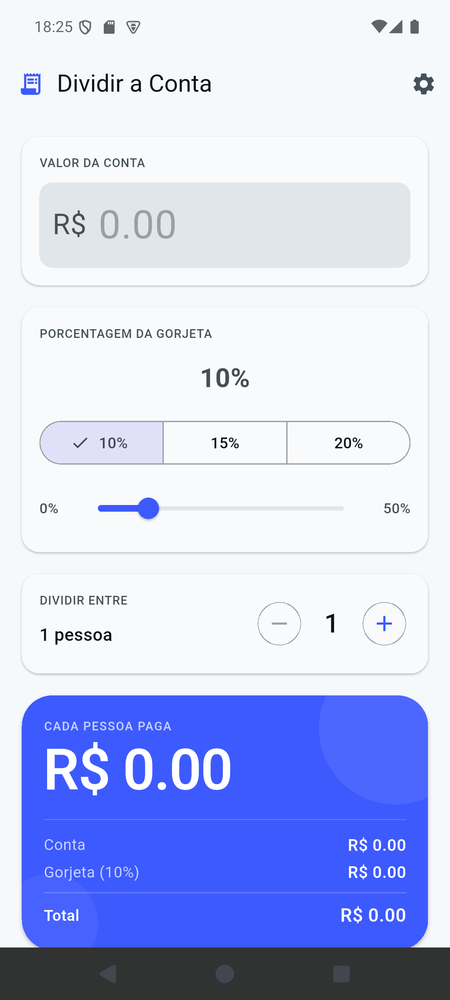

# Tip Splitter 💵

<div style="text-align: center;">

</div>

Professional bill splitting calculator app built with Flutter. Instantly calculate tip percentages and split bills fairly among friends.

## Overview

**Tip Splitter** is a clean, intuitive Android app designed to make splitting restaurant bills and calculating tips effortless. Whether you're at a casual lunch or a fancy dinner, this app handles the math while you enjoy the meal.

**Status**: v1.0.0 - Production Release  
**Platform**: Android (Minimum SDK: 21)  
**Build**: 49.4 MB APK

## Key Features

### 💰 Flexible Bill Input
- Enter any bill amount in Brazilian Real (R$)
- Clear, large display for easy readability
- Real-time calculations as you type

### 🎯 Smart Tip Calculation
- **Preset tip buttons**: 10%, 15%, 20% for quick selection
- **Custom slider**: Fine-tune tip from 0% to 50%
- Visual feedback with checkmark on selected tip

### 👥 Easy Bill Splitting
- Increment/decrement number of people with +/- buttons
- Automatically recalculates per-person cost
- Clear breakdown of costs

### 📊 Detailed Payment Breakdown
- **Bill amount** clearly displayed
- **Tip calculation** with percentage shown
- **Per-person cost** highlighted in prominent blue section
- Shows exact amounts for bill, tip, and total

## Screenshots

### Home Screen - Bill Calculator


The main interface displays:
- Bill amount input field
- Tip percentage selector with preset buttons and slider
- Number of people splitter
- Real-time cost breakdown
- Per-person payment summary in accent color

## Technical Stack

| Component | Technology |
|-----------|-----------|
| **Framework** | Flutter |
| **Language** | Dart |
| **State Management** | BLoC Pattern |
| **Storage** | Shared Preferences |
| **Build System** | Gradle |
| **Package Manager** | Pub |

## Dependencies

- **flutter_bloc** - State management
- **equatable** - Equality comparison
- **intl** - Internationalization
- **shared_preferences** - Local storage
- **animated_text_kit** - Text animations
- **cupertino_icons** - iOS-style icons

## Design System

### Color Palette
- **Primary**: #2541d4 (Vibrant Blue)
- **Theme**: #3d5afe (Accent Blue)
- **Background**: Light gray with white cards

### Typography
- Material Design compliant
- Clear, legible sans-serif fonts
- Supports Material Icons

### UX Principles
- Minimal, distraction-free interface
- Quick action buttons for common tip amounts
- Continuous feedback from slider interactions
- Large, tap-friendly controls

## Installation & Running

### Build Release APK
```bash
flutter build apk --release
```

Output: `build/app/outputs/flutter-apk/app-release.apk` (49.4 MB)

### Run on Emulator
```bash
flutter run --release
```

### Deploy to Device
```bash
flutter install -v
```

## Project Structure

```
tip_splitter/
├── lib/
│   ├── main.dart              # App entry point
│   ├── app.dart              # App configuration
│   ├── src/
│   │   ├── bloc/            # BLoC state management
│   │   ├── models/          # Data models
│   │   ├── views/           # UI screens
│   │   ├── widgets/         # Reusable components
│   │   └── utils/           # Helper functions
├── assets/
│   └── icon/                 # App icons and logos
│       ├── icon.png         # Main app icon
│       └── icon_foreground.png # Adaptive icon
├── android/
│   └── app/                  # Android native configuration
├── pubspec.yaml              # Dependencies
└── README.md                 # Original docs
```

## Features Highlights

✨ **What makes it special:**

1. **Instant Calculations** - Results update in real-time as you adjust values
2. **Smart Defaults** - Common tip percentages at your fingertips
3. **Flexible Control** - Both preset buttons and continuous slider for precision
4. **Clear Breakdown** - See exactly what each person owes before paying
5. **No Network Required** - Works completely offline
6. **Persistent Storage** - Remembers your preferences between sessions

## Performance

- **APK Size**: 49.4 MB (optimized Flutter build)
- **Startup Time**: <2 seconds
- **Memory Usage**: <100 MB at runtime
- **Target Android**: API 21+ (Android 5.0+)

## Localization

Currently supports Portuguese UI with internationalization framework ready for expansion to additional languages.

---

**Developer**: [Luisa Martin](mailto:luisa@luisamartins.dev)  
**License**: Proprietary  
**Last Updated**: April 2026
